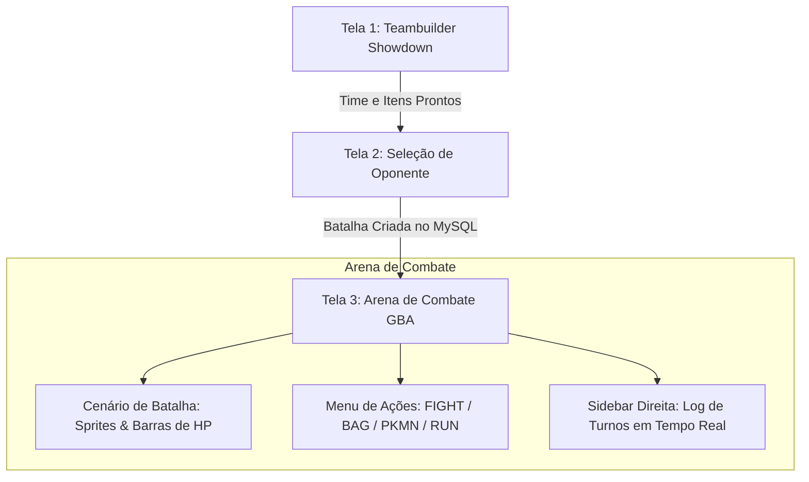

# 🎮 ESPECIFICAÇÃO TÉCNICA: POKÉMON FIRERED BATTLE SIMULATOR (WEB)

**Arquitetura:** Web Full-Stack (Frontend React + Backend Node.js/Express + Database Engine MySQL 8.0)  
**Estilo Visual:** Interface Retrô de GameBoy Advance (GBA) integrada com Teambuilder moderno estilo *Pokémon Showdown*.

---

## 1. Visão Geral do Sistema

O objetivo da aplicação é fornecer uma interface gráfica rica, interativa e nostálgica para simular combates de Pokémon FireRed diretamente no navegador, utilizando o banco de dados relacional **MySQL 8.0** como o motor matemático, transacional e de regras de combate.



---

## 2. As 3 Telas Principais da Aplicação

### 🛠️ Tela 1: Teambuilder (Construtor de Times Estilo Showdown)
Permite ao jogador montar seu time de até 6 Pokémons antes de entrar em campo:
1. **6 Slots de Pokémon**:
   - Cada slot exibe o sprite, apelido, espécie, nível (1 a 100) e os 4 golpes ativos.
   - **Busca de Pokémons**: Modal com os 151 Pokémons de Kanto pesquisáveis por nome ou tipo.
2. **Seleção de Held Item**:
   - Dropdown ou modal com os itens da tabela `held_item` (Leftovers, Charcoal, Mystic Water, Choice Band, Focus Band, etc.) com descrição do efeito.
   - Chama a procedure `sp_equipar_held_item` ou `sp_remover_held_item`.
3. **Seleção de 4 Golpes (Movepool)**:
   - Ao selecionar um Pokémon, o modal de golpes consulta `especie_movimento_nivel` e lista apenas os golpes compatíveis com aquela espécie e nível atual.
   - Exibe Tipo, Categoria (Físico/Especial), Poder, Precisão e PP.
4. **Mochila do Treinador (Bag Builder)**:
   - Definição da quantidade de itens de combate que o jogador levará na mochila (Potions, Super Potions, Hyper Potions, Revives, Ethers).

---

### 🥊 Tela 2: Seleção de Adversário (Opponent Picker)
Permite escolher contra quem você quer testar seu time:
* **Treinadores Prontos do Banco**:
  * **Blue (Rival / Campeão)**: Pidgeot, Alakazam, Rhydon, Exeggutor, Gyarados, Arcanine (Nível 50).
  * **Brock (Líder de Ginásio de Pewter)**: Geodude, Onix (Tipo Pedra).
  * **Misty (Líder de Ginásio de Cerulean)**: Staryu, Starmie (Tipo Água).
* **Botão "Batalha Rápida (Random Match)"**: Sorteia um treinador ou monta um time aleatório de 6 Pokémons selvagens para você enfrentar.
* Ao clicar em **"Batalhar!"**, o backend executa `CALL sp_iniciar_batalha(treinador_jogador_id, treinador_oponente_id)` e redireciona para a Arena.

---

### ⚔️ Tela 3: Arena de Combate GBA com Sidebar de Log
O layout da tela de batalha é dividido em duas colunas principais:

```
+-------------------------------------------------------------+----------------------+
|                    ARENA DE BATALHA (GBA)                   |  SIDEBAR DE LOG      |
|                                                             |                      |
|                     [Inimigo: Alakazam]                     |  [📜 Log de Batalha] |
|                     [HP Bar: 119/119 HP]                    |                      |
|                     [Sprite Frontal Rival]                  |  Turno 1:            |
|                                                             |  Charizard usou      |
|                                                             |  Flamethrower!       |
|                                                             |  Dano: 91            |
|                                                             |                      |
|  [Seu Pokémon: Charizard]                                   |  Turno 2:            |
|  [HP Bar: 113/152 HP]                                       |  Pidgeot desmaiou!   |
|  [Sprite Traseiro (Back)]                                   |  Blue enviou         |
|                                                             |  Alakazam!           |
|                                                             |                      |
+-------------------------------------------------------------+  Turno 3:            |
| MENU DE AÇÕES:                                              |  Red usou            |
| [ ⚔️ FIGHT (Lutar) ]           [ 🎒 BAG (Mochila) ]          |  Super Potion!       |
| [ 🔄 POKÉMON (Trocar) ]        [ 🏃 RUN (Fugir)   ]          |                      |
|                                                             |  Charizard           |
| (Ao clicar em FIGHT: exibe os 4 golpes, tipo, PP e poder)   |  recuperou HP com    |
| (Ao clicar em BAG: exibe poções e revives da mochila)       |  Leftovers!          |
| (Ao clicar em PKMN: lista os 6 do time com vida para troca) |  [Auto-scroll ⬇️]    |
+-------------------------------------------------------------+----------------------+
```

#### Recursos da Arena:
1. **Barras de HP Dinâmicas**:
   - Verde (> 50%), Amarelo (20% - 50%), Vermelho (< 20%).
   - Transição CSS animada suave quando a vida desce.
2. **Sprites Oficiais da PokéAPI**:
   - Oponente: `https://raw.githubusercontent.com/PokeAPI/sprites/master/sprites/pokemon/versions/generation-iii/firered-leafgreen/{id}.png`
   - Jogador (costas): `https://raw.githubusercontent.com/PokeAPI/sprites/master/sprites/pokemon/versions/generation-iii/firered-leafgreen/back/{id}.png`
3. **Sidebar de Log em Tempo Real**:
   - Exibe a narrativa completa de cada turno diretamente da tabela `log_batalha`.
   - Badges coloridas para **"Super Efetivo!"** (verde), **"Pouco Efetivo"** (vermelho), **"Leftovers"** (azul), **"Desmaiou!"** (preto).
   - Auto-scroll automático para a mensagem mais recente.
4. **Efeitos Visuais**:
   - Tremer a tela (`screen-shake`) ao receber dano crítico ou super efetivo.
   - Piscada do sprite ao tomar golpe (`flicker effect`).
   - Som do grito do Pokémon ao entrar em campo via PokéAPI Cries.

---

## 3. Arquitetura da Stack Tecnológica

### Backend: Node.js + Express (ou Fastify)
* **Biblioteca MySQL**: `mysql2/promise` (execução assíncrona de Stored Procedures).
* **Papel do Backend**: Atuar estritamente como uma camada leve de API REST, intermediando as chamadas HTTP do frontend para as Stored Procedures e Views do MySQL.

#### Especificação das Rotas da API:
| Método | Endpoint | Procedimento/View MySQL Chamado | Descrição |
| :--- | :--- | :--- | :--- |
| `GET` | `/api/pokedex` | `SELECT * FROM vw_pokedex_kanto` | Lista os 151 Pokémons com tipos e stats base. |
| `GET` | `/api/movimentos/:especieId` | `SELECT ... FROM especie_movimento_nivel` | Lista golpes disponíveis para a espécie. |
| `GET` | `/api/held-items` | `SELECT * FROM held_item` | Lista todos os held items disponíveis. |
| `GET` | `/api/treinadores` | `SELECT * FROM treinador` | Lista treinadores disponíveis para combate. |
| `GET` | `/api/treinador/:id/time` | `SELECT ... FROM pokemon_instancia` | Retorna os 6 Pokémons do treinador com golpes e HP. |
| `GET` | `/api/treinador/:id/mochila` | `SELECT ... FROM treinador_mochila` | Retorna itens e quantidades na mochila. |
| `POST` | `/api/pokemon/criar` | `CALL sp_criar_pokemon_treinador(...)` | Adiciona um novo Pokémon ao time. |
| `POST` | `/api/pokemon/held-item` | `CALL sp_equipar_held_item(...)` | Equipa um held item (fora de combate). |
| `POST` | `/api/pokemon/remover-held-item` | `CALL sp_remover_held_item(...)` | Remove o item segurado (fora de combate). |
| `POST` | `/api/pokemon/trocar-golpe` | `CALL sp_trocar_movimento_pokemon(...)` | Altera um golpe do Pokémon. |
| `POST` | `/api/centro-pokemon` | `CALL sp_enfermeira_joy(treinador_id)` | Cura o time inteiro com a Joy. |
| `POST` | `/api/batalha/iniciar` | `CALL sp_iniciar_batalha(jog_id, opo_id)` | Cria a batalha no banco e retorna o `batalha_id`. |
| `POST` | `/api/batalha/turno` | `CALL sp_executar_turno_batalha(bat_id, mov_id)` | Processa o ataque, calcula dano e avança turno. |
| `POST` | `/api/batalha/trocar` | `CALL sp_trocar_pokemon_batalha(bat_id, novo_pok_id)` | Troca o Pokémon em combate e sofre retaliação. |
| `POST` | `/api/batalha/usar-item` | `CALL sp_usar_item_batalha(bat_id, item_id, alvo_id)` | Usa poção/revive e sofre retaliação. |
| `GET` | `/api/batalha/:id/status` | `SELECT ... FROM batalha JOIN pokemon_instancia` | Retorna estado atual, HPs e Pokémons em campo. |
| `GET` | `/api/batalha/:id/logs` | `SELECT * FROM log_batalha WHERE batalha_id = ?` | Retorna o histórico de mensagens do log. |

---

### Frontend: React (Vite)
* **Framework**: React 18 + Vite (alta performance e hot-reload instantâneo).
* **Estilização**: CSS Vanilla ou TailwindCSS com classes pixel-art:
  * Fonte retrô: Google Fonts `'Press Start 2P'`.
  * Filtro de nitidez de pixel: `image-rendering: pixelated;`.
* **Gerenciamento de Estado**: Zustand ou React Context (armazena batalha atual, time ativo e logs).
* **Áudio**: Web Audio API para tocar gritos dos Pokémons e efeitos de ataque.

---

## 4. Estrutura de Pastas do Projeto Proposto

```text
pokemon-firered-app/
├── backend/
│   ├── src/
│   │   ├── config/
│   │   │   └── database.js          # Pool de conexão mysql2 com 127.0.0.1:3306
│   │   ├── controllers/
│   │   │   ├── batalhaController.js # Lógica de batalha (turno, troca, item)
│   │   │   ├── teambuilderController.js # Lógica de montagem de time
│   │   │   └── pokedexController.js # Consultas de espécies, golpes e held items
│   │   ├── routes/
│   │   │   └── api.js               # Definição dos endpoints REST
│   │   └── server.js                # Inicialização do Express (porta 3001)
│   └── package.json
│
├── frontend/
│   ├── src/
│   │   ├── assets/                  # Cenários de fundo, bordas retrô, ícones
│   │   ├── components/
│   │   │   ├── Battle/
│   │   │   │   ├── BattleArena.jsx   # Layout principal da arena
│   │   │   │   ├── BattleField.jsx   # Sprites do oponente e do jogador
│   │   │   │   ├── HpBar.jsx         # Barra de vida com gradiente verde/amarelo/vermelho
│   │   │   │   ├── BattleMenu.jsx    # Caixa clássica FIGHT / BAG / PKMN / RUN
│   │   │   │   ├── MovesGrid.jsx     # Grid dos 4 golpes com PP e tipo
│   │   │   │   ├── BagModal.jsx      # Modal de escolha de itens da mochila
│   │   │   │   └── SwitchModal.jsx   # Modal de troca voluntária de Pokémon
│   │   │   ├── Log/
│   │   │   │   └── BattleLogSidebar.jsx # Sidebar com rolagem automática dos logs
│   │   │   └── Teambuilder/
│   │   │       ├── TeamOverview.jsx  # Visão dos 6 Pokémons do jogador
│   │   │       ├── PokemonCard.jsx   # Card com stats, item e golpes
│   │   │       ├── MovePicker.jsx    # Modal de seleção de golpes válidos
│   │   │       └── ItemPicker.jsx    # Modal de held items
│   │   ├── services/
│   │   │   └── api.js               # Chamadas Axios/Fetch para o backend
│   │   ├── App.jsx                  # Navegação entre Teambuilder e Arena
│   │   ├── index.css                # Estilos globais, fonte 'Press Start 2P' e pixel art
│   │   └── main.jsx
│   └── package.json
│
└── database/
    └── dump_pokemon_firered.sql      # Dump do banco de dados oficial (já pronto!)
```

---

## 5. Roteiro de Implementação em 4 Fases

### Fase 1: API Backend de Conexão com o MySQL (2 dias)
1. Iniciar projeto Node.js com Express e `mysql2`.
2. Criar o arquivo de conexão com o banco `pokemon_firered`.
3. Implementar as rotas de Batalha que chamam as Stored Procedures:
   - `sp_iniciar_batalha`
   - `sp_executar_turno_batalha`
   - `sp_trocar_pokemon_batalha`
   - `sp_usar_item_batalha`
4. Testar os endpoints via Insomnia ou Postman.

### Fase 2: Arena de Batalha & Sidebar de Logs (3 dias)
1. Montar a interface de batalha em React com visual GBA (cenário de grama/caverna).
2. Carregar sprites frontal e traseiro usando as URLs da PokéAPI CDN.
3. Conectar a Sidebar de Logs com a tabela `log_batalha`.
4. Implementar botões de ação:
   - Clicar em **FIGHT** $\rightarrow$ exibe 4 golpes $\rightarrow$ clica em golpe $\rightarrow$ chama backend $\rightarrow$ animação de HP $\rightarrow$ atualiza log na sidebar.

### Fase 3: Teambuilder Estilo Showdown (3 dias)
1. Criar a tela de Teambuilder para personalizar o time de 6 Pokémons:
   - Adicionar ou trocar Pokémon da equipe.
   - Ensinar golpes (`sp_trocar_movimento_pokemon`).
   - Equipar Held Items (`sp_equipar_held_item`).
   - Ajustar mochila de itens.
2. Botão da **Enfermeira Joy** no Teambuilder para curar todo o time antes de entrar na arena.

### Fase 4: Seleção de Adversários, Sons e Polimento (2 dias)
1. Modal para escolher enfrentar Blue, Brock, Misty ou um time aleatório.
2. Integração de áudio: gritos dos Pokémons ao entrar em combate via PokéAPI Cries e sons clássicos de ataque.
3. Detecção de fim de batalha: tela de vitória ou derrota com exibição de EXP acumulado.

---

## 6. Exemplo de Código do Backend (Conexão Direta com a Procedure)

```javascript
// Exemplo: controller de execução de turno no Node.js
import { db } from '../config/database.js';

export async function executarTurno(req, res) {
    const { batalhaId, movimentoId } = req.body;
    try {
        // Chama a stored procedure que criamos no MySQL
        const [results] = await db.query(
            'CALL sp_executar_turno_batalha(?, ?)', 
            [batalhaId, movimentoId]
        );

        // Busca o status atualizado da batalha
        const [batalha] = await db.query(
            `SELECT b.status, b.turno_atual,
                    p1.id as jog_id, p1.apelido as jog_nome, p1.hp_atual as jog_hp, p1.hp_max as jog_hp_max,
                    p2.id as opo_id, p2.apelido as opo_nome, p2.hp_atual as opo_hp, p2.hp_max as opo_hp_max
             FROM batalha b
             JOIN pokemon_instancia p1 ON b.pokemon_ativo_jogador_id = p1.id
             JOIN pokemon_instancia p2 ON b.pokemon_ativo_oponente_id = p2.id
             WHERE b.id = ?`,
            [batalhaId]
        );

        // Busca os logs do turno recém-executado
        const [logs] = await db.query(
            'SELECT * FROM log_batalha WHERE batalha_id = ? ORDER BY id DESC LIMIT 4',
            [batalhaId]
        );

        return res.json({
            sucesso: true,
            status: batalha[0],
            logs: logs.reverse()
        });
    } catch (error) {
        return res.status(400).json({ erro: error.message });
    }
}
```
